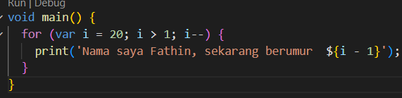
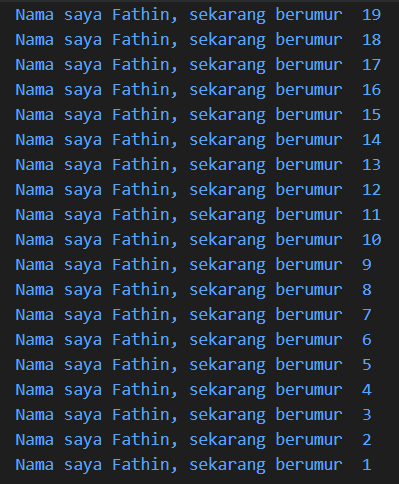

# Laporan Praktikum #02 - Pemrograman Dasar Dart - Bag.1 (Variabel dan Tipe Data)

## Identitas Mahasiswa

| Nama    | Atiqah Fathin Fauziyyah |
| NIM     | 244107060031            |
| Kelas   | SIB-2E                  |

---

## Tugas Praktikum 2

### Soal 1

Modifikasilah kode pada baris 3 di VS Code atau Editor Code favorit Anda berikut ini agar mendapatkan keluaran (output) sesuai yang diminta!

```dart
void main() {
  for (int i = 0; i < 10; i++) {
    print("Hello ${i + 2}");
  }
}
```

**Jawaban:**





---

### Soal 2

Mengapa sangat penting untuk memahami bahasa pemrograman Dart sebelum kita menggunakan framework Flutter? Jelaskan!

**Jawaban:**

Memahami Dart sangat penting karena merupakan bahasa dasar yang menyusun seluruh ekosistem Flutter. Mulai dari logika bisnis hingga pembuatan komponen antarmuka (widget) semuanya ditulis menggunakan sintaks Dart.

---

### Soal 3

Rangkumlah materi dari codelab ini menjadi poin-poin penting yang dapat Anda gunakan untuk membantu proses pengembangan aplikasi mobile menggunakan framework Flutter.

**Jawaban:**

1. **Variabel**
Variabel digunakan untuk menyimpan data yang akan diproses dalam program.

Di Dart (Flutter menggunakan bahasa Dart), variabel bisa dibuat dengan beberapa cara:
   - var → tipe data ditentukan otomatis oleh sistem (type inference).
   - final → nilainya hanya bisa diisi satu kali (tidak bisa diubah lagi).
   - const → konstanta yang nilainya sudah pasti saat compile-time.

```dart
var nama = "Atiqah";
final umur = 20;
const pi = 3.14;
```

2. **Tipe Data**
   - Tipe data adalah jenis data yang dapat disimpan dalam variabel.
   - Tipe data pada Dart meliputi: `int`, `double`, `String`, `bool`, `List`, `Map`, dan lain-lain.

3. **Null Safety**
   - Null safety adalah fitur yang diperkenalkan pada Dart 2.0 yang memungkinkan pengembang untuk menentukan apakah suatu variabel dapat bernilai null atau tidak.
   - Null safety mencegah kesalahan yang diakibatkan oleh akses variabel yang tidak disengaja yang bernilai null.

4. **Late Variabel**
   - Late variabel adalah fitur yang memungkinkan pengembang untuk menunda inisialisasi variabel sampai variabel tersebut digunakan.
   - Late keyword adalah kontrak antara pengembang dan dart. pengembang memberitahu dart bahwa variabel tersebut akan diinisialisasi sebelum digunakan. Jika variabel tersebut tidak diinisialisasi sebelum digunakan, maka akan terjadi kesalahan runtime.

---

### Soal 4

Buatlah penjelasan dan contoh eksekusi kode tentang perbedaan Null Safety dan Late variabel!

**Jawaban:**

#### Null Safety

   - Null safety adalah fitur yang diperkenalkan pada Dart 2.0 yang memungkinkan pengembang untuk menentukan apakah suatu variabel dapat bernilai null atau tidak.
   - Null safety mencegah kesalahan yang diakibatkan oleh akses variabel yang tidak disengaja yang bernilai null.
   - Jika ingin memperbolehkan null, tambahkan tanda ?.

```dart
String nama;      // Tidak boleh null
String? alamat;   // Boleh null = tambahkan ?
```

#### Late Variabel

   - Late variabel adalah fitur yang memungkinkan pengembang untuk menunda inisialisasi variabel sampai variabel tersebut digunakan.
   - Late keyword adalah kontrak antara pengembang dan dart. pengembang memberitahu dart bahwa variabel tersebut akan diinisialisasi sebelum digunakan. Jika variabel tersebut tidak diinisialisasi sebelum digunakan, maka akan terjadi kesalahan runtime.

```dart
late String deskripsi;

void ambilData() {
  deskripsi = "Data berhasil diambil";
}
```
Jika variabel late digunakan sebelum diberi nilai, maka akan muncul error saat runtime.