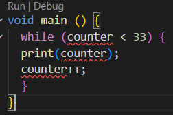
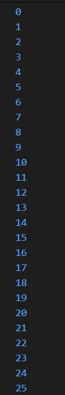
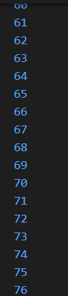
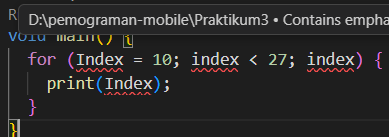
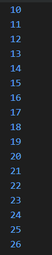
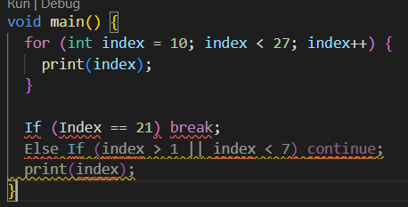
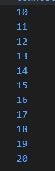
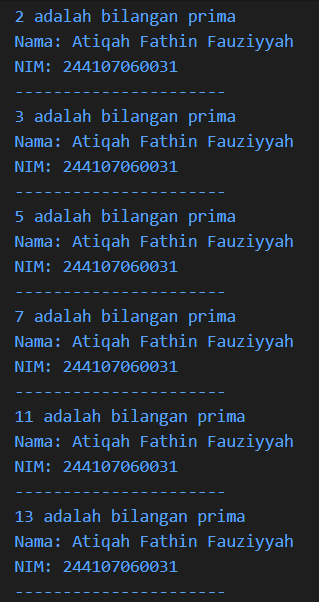

# Laporan Praktikum #03 - Pemrograman Dasar Dart - Bag.2

## Identitas Mahasiswa 

| Atribut | Nilai                   |
| ------- | ----------------------- |
| Nama    | Atiqah Fathin Fauziyyah |
| NIM     | 244107060031            |
| Kelas   | SIB-2E                  |

---

## Praktikum 1

### Langkah 1
```dart
String test = "test2";
if (test == "test1") {
   print("Test1");
} else If (test == "test2") {
   print("Test2");
} Else {
   print("Something else");
}

if (test == "test2") print("Test2 again");
```

### Langkah 2

Silakan coba eksekusi (Run) kode pada langkah 1 tersebut. Apa yang terjadi? Jelaskan!

**Jawaban:**


Kode pada langkah 1 mengalami **error** saat dieksekusi. Hal ini disebabkan karena penulisan keyword `If` dan `Else` menggunakan huruf kapital di awal. Dart bersifat **case-sensitive**, sehingga `If` dan `Else` tidak dikenali sebagai keyword yang valid. Penulisan yang benar adalah `if` dan `else` (seluruhnya huruf kecil). Dibawah ini adalah code perbaikannya!

```dart
void main() {
  String test = "test2";
  if (test == "test1") {
    print("Test1");
  } else if (test == "test2") {
    print("Test2");
  } else {
    print("Something else");
  }

  if (test == "test2") print("Test2 again");
}
```

Output setelah diperbaiki:


### Langkah 3

Tambahkan kode program berikut, lalu coba eksekusi (Run) kode Anda.

```dart
String test = "true";
if (test) {
   print("Kebenaran");
}
```

**Jawaban:**


Kode di atas mengalami **2 error**. Pertama, variabel `test` dideklarasikan dua kali dalam satu scope (di dalam fungsi atau blok yang sama). Di baris awal kita sudah menulis `String test = "test2";`, lalu di baris 13 kita menulis lagi `String test = "true";`. Dart tidak mengizinkan dua variabel dengan nama yang sama dalam satu ruang lingkup, sehingga muncul error _test is already declared in this scope_.

Kedua, menggunakan `if (test)` padahal `test` bertipe `String`. Pada Dart, kondisi di dalam `if` harus bertipe `bool`, bukan `String`. Karena itu muncul _error A value of type 'String' can't be assigned to a variable of type 'bool'_. Jika ingin mengecek isi `string`, seharusnya ditulis seperti `if (test == "true")` atau gunakan variabel bertipe `bool` misalnya `bool test = true;`.

Berikut kode yang sudah diperbaiki agar tetap menggunakan `if/else`:

```dart
String test2 = "true";
if (test2 == "true") {
   print("Kebenaran");
}
```

Output setelah diperbaiki:


---

## Praktikum 2

### Langkah 1
```dart
while (counter < 33) {
  print(counter);
  counter++;
}
```

### Langkah 2

Silakan coba eksekusi (Run) kode pada langkah 1 tersebut. Apa yang terjadi? Jelaskan!

**Jawaban:**



Error dikarenakan variabel `counter` belum dideklarasikan sebelum digunakan di dalam `while`. Dart harus tahu dulu tipe dan nilai awal variabelnya. Dibawah ini adalah code perbaikannya!

```dart
void main() {
  int counter = 0;

  while (counter < 33) {
    print(counter);
    counter++;
  }
}
```

Output setelah diperbaiki:



### Langkah 3

Tambahkan kode program berikut, lalu coba eksekusi (Run) kode Anda.

```dart
do {
  print(counter);
  counter++;
} while (counter < 77);
```

**Jawaban:**

Kode di atas pada perulangan `do-while` akan melanjutkan perulangan dari nilai `counter` terakhir pada perulangan `while`, yaitu `33`. Sehingga perulangan `do-while` akan berjalan dari `33` hingga `76`. Output dibawah ini:



---

## Praktikum 3

### Langkah 1
```dart
for (Index = 10; index < 27; index) {
  print(Index);
}
```

### Langkah 2

Silakan coba eksekusi (Run) kode pada langkah 1 tersebut. Apa yang terjadi? Jelaskan!

**Jawaban:**



Ada 3 kesalahan:

1. `Index` belum dideklarasikan (tidak ada tipe datanya).
2. Penulisan huruf besar-kecil beda (`Index` dan `index`) → Dart **case-sensitive**.
3. Tidak ada `index++` (increment) di bagian akhir `for`.

Dibawah ini adalah code perbaikannya!

```dart
void main() {
  for (int index = 10; index < 27; index++) {
    print(index);
  }
}
```

Output setelah diperbaiki:



### Langkah 3

Tambahkan kode program berikut di dalam _for-loop_, lalu coba eksekusi (Run) kode Anda.

```dart
If (Index == 21) break;
Else If (index > 1 || index < 7) continue;
print(index);
```

**Jawaban:**



**Kenapa error?**

1. `If` dan `Else If` harus huruf kecil → `if` dan `else if`.
2. `Index` dan `index` beda huruf besar-kecil (Dart **case-sensitive**).
3. `index` dipakai di luar `for`, padahal variabel `index` hanya berlaku di dalam blok `for`.
4. `break` dan `continue` hanya boleh dipakai di dalam loop, bukan di luar.

Berikut kode yang sudah diperbaiki:

```dart
void main() {
  for (int index = 10; index < 27; index++) {
    
    if (index == 21) break;
    else if (index > 1 && index < 7) continue;

    print(index);
  }
}
```

Output setelah diperbaiki:



---

## Tugas Praktikum

Buatlah sebuah program yang dapat menampilkan bilangan prima dari angka 0 sampai 201 menggunakan Dart. Ketika bilangan prima ditemukan, maka tampilkan nama lengkap dan NIM Anda.

**Jawaban:**

```dart
void main() {
  String nama = "Atiqah Fathin Fauziyyah";
  String nim = "244107060031";

  for (int angka = 0; angka <= 201; angka++) {
    bool isPrima = true;

    if (angka < 2) {
      isPrima = false;
    } else {
      for (int i = 2; i <= angka ~/ 2; i++) {
        if (angka % i == 0) {
          isPrima = false;
          break;
        }
      }
    }

    if (isPrima) {
      print("$angka adalah bilangan prima");
      print("Nama: $nama");
      print("NIM: $nim");
      print("----------------------");
    }
  }
}
```

Output Code:

