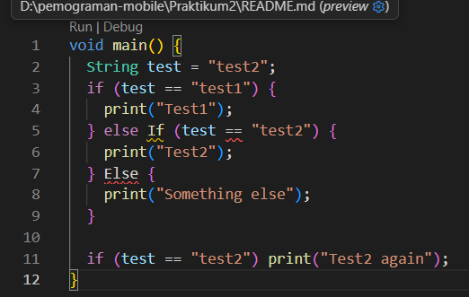
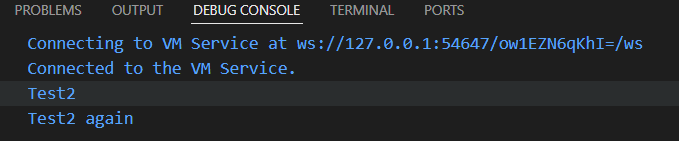
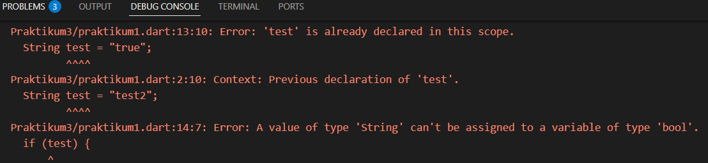
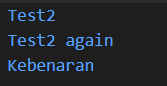

# Laporan Praktikum #03 - Pemrograman Dasar Dart - Bag.2

## Identitas Mahasiswa

| Atribut | Nilai                   |
| ------- | ----------------------- |
| Nama    | Atiqah Fathin Fauziyyah |
| NIM     | 244107060031            |
| Kelas   | SIB-2E                  |

---

## Tugas Praktikum 1

### Langkah 1
```dart
String test = "test2";
if (test == "test1") {
   print("Test1");
} else If (test == "test2") {
   print("Test2");
} Else {
   print("Something else");
}

if (test == "test2") print("Test2 again");
```

### Langkah 2

Silakan coba eksekusi (Run) kode pada langkah 1 tersebut. Apa yang terjadi? Jelaskan!



Kode pada langkah 1 mengalami **error** saat dieksekusi. Hal ini disebabkan karena penulisan keyword `If` dan `Else` menggunakan huruf kapital di awal. Dart bersifat **case-sensitive**, sehingga `If` dan `Else` tidak dikenali sebagai keyword yang valid. Penulisan yang benar adalah `if` dan `else` (seluruhnya huruf kecil).

Berikut kode yang sudah diperbaiki:

```dart
void main() {
  String test = "test2";
  if (test == "test1") {
    print("Test1");
  } else if (test == "test2") {
    print("Test2");
  } else {
    print("Something else");
  }

  if (test == "test2") print("Test2 again");
}
```

Output setelah diperbaiki:



### Langkah 3

Tambahkan kode program berikut, lalu coba eksekusi (Run) kode Anda.

```dart
String test = "true";
if (test) {
   print("Kebenaran");
}
```

**Jawaban:**

Kode di atas mengalami **2 error**. Pertama, variabel `test` dideklarasikan dua kali dalam satu scope (di dalam fungsi atau blok yang sama). Di baris awal kita sudah menulis `String test = "test2";`, lalu di baris 13 kita menulis lagi `String test = "true";`. Dart tidak mengizinkan dua variabel dengan nama yang sama dalam satu ruang lingkup, sehingga muncul error `test is already declared in this scope`.

Kedua, menggunakan `if (test)` padahal `test` bertipe `String`. Pada Dart, kondisi di dalam `if` harus bertipe `bool`, bukan `String`. Karena itu muncul _error A value of type 'String' can't be assigned to a variable of type 'bool'_. Jika ingin mengecek isi `string`, seharusnya ditulis seperti `if (test == "true")` atau gunakan variabel bertipe `bool` misalnya `bool test = true;`.



Berikut kode yang sudah diperbaiki agar tetap menggunakan `if/else`:

```dart
String test2 = "true";
if (test2 == "true") {
   print("Kebenaran");
}
```

Output setelah diperbaiki:



---