# Laporan Praktikum #04 - Pemrograman Dasar Dart - Bag.3 (Collections dan Functions)

## Identitas Mahasiswa 

| Atribut | Nilai                   |
| ------- | ----------------------- |
| Nama    | Atiqah Fathin Fauziyyah |
| NIM     | 244107060031            |
| Kelas   | SIB-2E                  |

---

## Praktikum 1

### Langkah 1
```dart
var list = [1, 2, 3];
assert(list.length == 3);
assert(list[1] == 2);
print(list.length);
print(list[1]);

list[1] = 1;
assert(list[1] == 1);
print(list[1]);
```

### Langkah 2

Silakan coba eksekusi (Run) kode pada langkah 1 tersebut. Apa yang terjadi? Jelaskan!

**Jawaban:**


1. `var list = [1, 2, 3];`
    * Sebuah list dibuat dengan isi 3 elemen: 1, 2, 3.
    * Index list dimulai dari 0.

2. `assert(list.length == 3);`
    * list.length = 3 karena ada 3 elemen.
    * assert digunakan untuk memastikan kondisi benar saat debugging.
    * Karena benar, program lanjut tanpa error.

3. `assert(list[1] == 2);`
    * list[1] berarti elemen kedua.
    * Nilainya memang 2.
    * Kondisi benar berarti program lanjut.

4. `print(list.length);`
    * Menampilkan panjang list
    * Output 3

5. `print(list[1]);`
    * Menampilkan elemen index 1
    * Output 2

6. `list[1] = 1;`
    * Elemen pada index 1 diubah dari 2 menjadi 1.

7. `assert(list[1] == 1);`
    * Sekarang list[1] memang 1.
    * Kondisi benar berarti program lanjut.

8. `print(list[1]);`
    * Output 1

### Langkah 3

Ubah kode pada langkah 1 menjadi variabel final yang mempunyai index = 5 dengan default value = null. Isilah nama dan NIM Anda pada elemen index ke-1 dan ke-2. Lalu print dan capture hasilnya.

**Jawaban:**

```dart
void main() {
  final List<String?> data = List.filled(5, null);

  data[1] = "Atiqah Fathin Fauziyyah";
  data[2] = "244107060031";

  print(data);
}
```

1. `final List<String?> data = List.filled(5, null);`
    * Membuat list dengan panjang 5.
    * Semua elemen awalnya null.
    * String? artinya boleh berisi String atau null.

2. `data[1] = "Atiqah Fathin Fauziyyah"; data[2] = "244107060031";`
    * Mengisi data pada index ke 1 dan 2.

3. `print(data);`
    * Menampilkan isi list.

Output dari program diatas:


---

## Praktikum 2

### Langkah 1
```dart
var halogens = {'fluorine', 'chlorine', 'bromine', 'iodine', 'astatine'};
print(halogens);
```

### Langkah 2

Silakan coba eksekusi (Run) kode pada langkah 1 tersebut. Apa yang terjadi? Jelaskan! Lalu perbaiki jika terjadi error.

**Jawaban:**

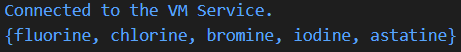

Kode tersebut membuat Set bernama `halogens`. Ketika `print(halogens);` dijalankan, program akan menampilkan semua elemen dalam Set.

### Langkah 3

Tambahkan kode program berikut, lalu coba eksekusi (Run) kode Anda.

```dart
var names1 = <String>{};
Set<String> names2 = {}; // This works, too.
var names3 = {}; // Creates a map, not a set.

print(names1);
print(names2);
print(names3);
```

**Jawaban:**

* halogens membuat Set yang berisi beberapa elemen kimia dan kemudian ditampilkan dengan print.
* names1 = <String>{} membuat Set kosong bertipe String.
* names2 = {} juga membuat Set kosong bertipe String.
* names3 = {} sebenarnya membuat Map kosong, bukan Set.

Output dari Program diatas:

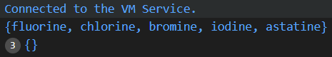

Tambahkan elemen nama dan NIM Anda pada kedua variabel Set tersebut dengan dua fungsi berbeda yaitu `.add()` dan `.addAll()`. Untuk variabel Map dihapus, nanti kita coba di praktikum selanjutnya.

**Jawaban:**

```dart
void main() {
  var halogens = {'fluorine', 'chlorine', 'bromine', 'iodine', 'astatine'};
  print(halogens);

  var names1 = <String>{};
  Set<String> names2 = {};

  // menambahkan data menggunakan add() → menambah 1 elemen
  names1.add("Atiqah Fathin Fauziyyah");
  names1.add("244107060031");

  // menambahkan data menggunakan addAll() → menambah banyak elemen sekaligus
  names2.addAll({
    "Atiqah Fathin Fauziyyah",
    "244107060031"
  });

  print(names1);
  print(names2);
}
```

Output dari Program diatas:

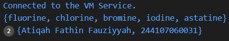

---

## Praktikum 3

### Langkah 1
```dart
var gifts = {
  // Key:    Value
  'first': 'partridge',
  'second': 'turtledoves',
  'fifth': 1
};

var nobleGases = {
  2: 'helium',
  10: 'neon',
  18: 2,
};

print(gifts);
print(nobleGases);
```

### Langkah 2

Silakan coba eksekusi (Run) kode pada langkah 1 tersebut. Apa yang terjadi? Jelaskan! Lalu perbaiki jika terjadi error.

**Jawaban:**

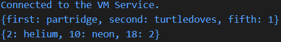

* `gifts` adalah Map dengan key bertipe String dan value berisi data hadiah.
* `nobleGases` juga Map, tetapi key-nya bertipe int (angka atom gas mulia).
* Pada kedua Map ada value yang berupa angka (1 dan 2), jadi value bisa berbeda tipe.

### Langkah 3

Tambahkan kode program berikut, lalu coba eksekusi (Run) kode Anda.

```dart
var mhs1 = Map<String, String>();
gifts['first'] = 'partridge';
gifts['second'] = 'turtledoves';
gifts['fifth'] = 'golden rings';

var mhs2 = Map<int, String>();
nobleGases[2] = 'helium';
nobleGases[10] = 'neon';
nobleGases[18] = 'argon';
```

Output dari Program diatas:

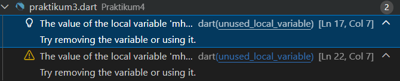

Apa yang terjadi ? Jika terjadi error, silakan perbaiki.
```dart
// Tambahkan Ini
print(mhs1);
print(mhs2);
```

Hasil Program diatas:

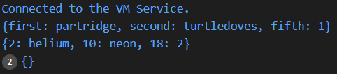

Tambahkan elemen nama dan NIM Anda pada tiap variabel di atas (gifts, nobleGases, mhs1, dan mhs2).

**Jawaban:**

```dart
// menambahkan nama dan NIM
  gifts['nama'] = 'Atiqah Fathin Fauziyyah';
  gifts['nim'] = '244107060031';

  nobleGases[02] = 'Atiqah Fathin Fauziyyah';
  nobleGases[02] = '244107060031';

  mhs1['nama'] = 'Atiqah Fathin Fauziyyah';
  mhs1['nim'] = '244107060031';

  mhs2[02] = 'Atiqah Fathin Fauziyyah';
  mhs2[02] = '244107060031';

  print(gifts);
  print(nobleGases);
  print(mhs1);
  print(mhs2);
```

Output dari Program diatas:

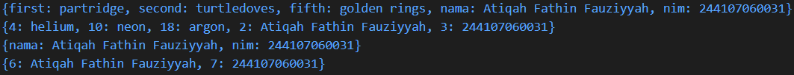

---

## Praktikum 4

### Langkah 1
```dart
var list = [1, 2, 3];
var list2 = [0, ...list];
print(list1);
print(list2);
print(list2.length);
```

### Langkah 2

Silakan coba eksekusi (Run) kode pada langkah 1 tersebut. Apa yang terjadi? Jelaskan! Lalu perbaiki jika terjadi error.

**Jawaban:**

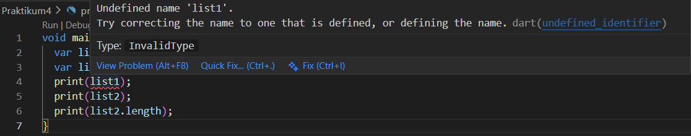

Yang terjadi : 
1. var list = [1,2,3]; → membuat List berisi angka 1, 2, 3
2. var list2 = [0, ...list]; → menggunakan spread operator (...) untuk memasukkan semua isi list ke dalam list2
3. print(list1); → tidak menampilkan list, karena belum dibuat var list1 nya
4. print(list2); → menampilkan list kedua
5. print(list2.length); → menampilkan jumlah elemen dalam list2

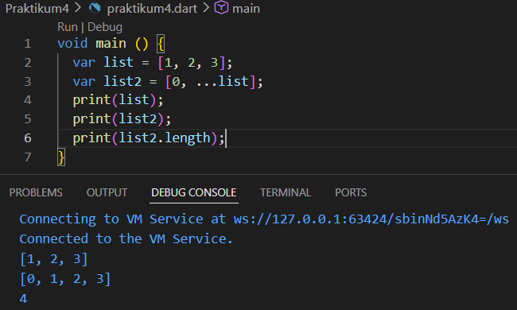

### Langkah 3

Tambahkan kode program berikut, lalu coba eksekusi (Run) kode Anda.

```dart
list1 = [1, 2, null];
print(list1);
var list3 = [0, ...?list1];
print(list3.length);
```

**Jawaban:**

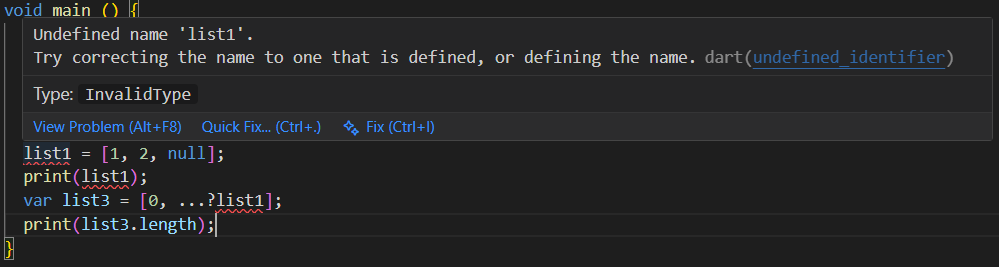

Apa yang terjadi ? Jika terjadi error, silakan perbaiki.

Yang terjadi :
1. list1 = [1,2,null]; Error karena list1 tidak dideklarasikan.
2. ...?list1 Ini adalah Null-aware spread operator, yang artinya jika list1 null maka tidak dimasukkan ke list.

Tambahkan variabel list berisi NIM Anda menggunakan Spread Operators.

```dart
void main() {
  var list = [1, 2, 3];
  var list2 = [0, ...list];

  print(list);
  print(list2);
  print(list2.length);

  List<int?> list1 = [1, 2, null];
  print(list1);

  var list3 = [0, ...?list1];
  print(list3);
  print(list3.length);

  var nim = [244107060031];
  var listNim = [...nim];

  print(listNim);
}
```

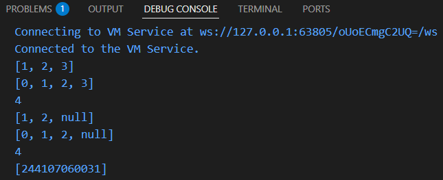

### Langkah 4

Tambahkan kode program berikut, lalu coba eksekusi (Run) kode Anda.
```dart
var nav = ['Home', 'Furniture', 'Plants', if (promoActive) 'Outlet'];
print(nav);
```

**Jawaban:**

Apa yang terjadi ? Jika terjadi error, silakan perbaiki. Tunjukkan hasilnya jika variabel promoActive ketika true dan false.

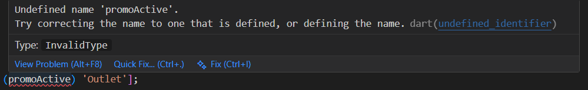

Kode di atas menggunakan fitur collection If pada list Dart, terjadi error karena promoActive belum dideklarasikan sebelumnya.

Perbaikan : 

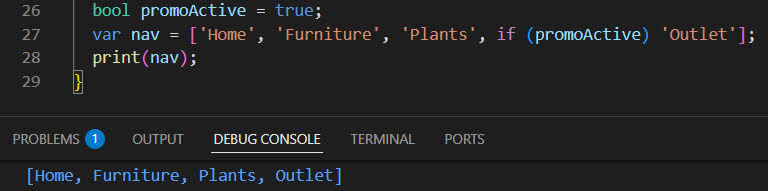

### Langkah 5

Tambahkan kode program berikut, lalu coba eksekusi (Run) kode Anda.

```dart
var nav2 = ['Home', 'Furniture', 'Plants', if (login case 'Manager') 'Inventory'];
print(nav2);
```

Apa yang terjadi ? Jika terjadi error, silakan perbaiki. Tunjukkan hasilnya jika variabel login mempunyai kondisi lain.

**Jawaban:**

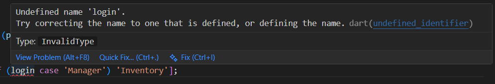

Sintaks if (login case 'Manager') adalah fitur pattern matching di Dart yang digunakan untuk mengecek apakah nilai variabel login sama dengan 'Manager', namun terjadi error karena variabel login  belum dideklarasikan sebelumnya.

Perbaikan:

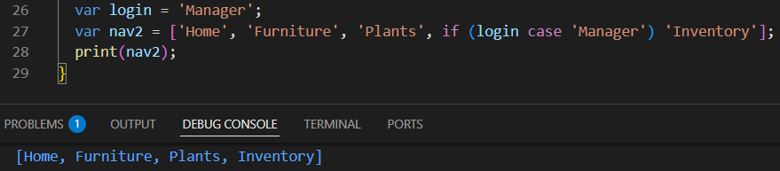

### Langkah 6

Tambahkan kode program berikut, lalu coba eksekusi (Run) kode Anda.
```dart
var listOfInts = [1, 2, 3];
var listOfStrings = ['#0', for (var i in listOfInts) '#$i'];
assert(listOfStrings[1] == '#1');
print(listOfStrings);
```

Apa yang terjadi ? Jika terjadi error, silakan perbaiki. Jelaskan manfaat Collection For dan dokumentasikan hasilnya.

**Jawaban:**

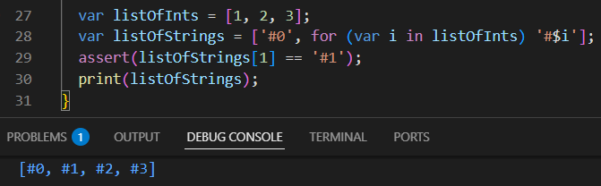

Manfaat collection For :
1. Membuat kode lebih singkat dan rapi
2. Mempermudah pembuatan data dari perulangan
3. Mengurangi panggunaan variabel tambahan

---

## Praktikum 5

### Langkah 1
```dart
var record = ('first', a: 2, b: true, 'last');
print(record)
```

### Langkah 2

Silakan coba eksekusi (Run) kode pada langkah 1 tersebut. Apa yang terjadi? Jelaskan! Lalu perbaiki jika terjadi error.

**Jawaban:**

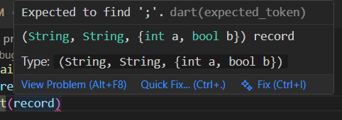

Kode ini mengalami error saat kompilasi karena ada semicolon (;) yang hilang di baris print(record). Setelah ditambahkan, kode berjalan normal. Kode tersebut membuat sebuah record, yaitu tipe data di dart yang dapat menyimpan beberaoa nilai dalma satu variabel.

Perbaikan :

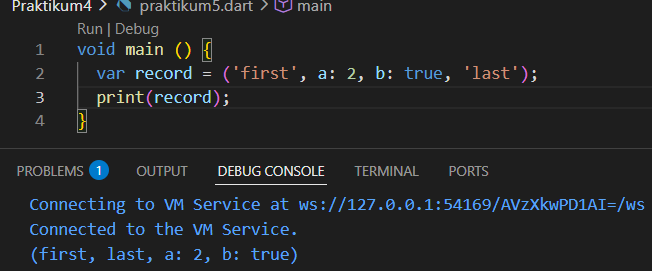

### Langkah 3

Tambahkan kode program berikut di luar scope void main(), lalu coba eksekusi (Run) kode Anda.
```dart
(int, int) tukar((int, int) record) {
  var (a, b) = record;
  return (b, a);
}
```

Apa yang terjadi ? Jika terjadi error, silakan perbaiki. Gunakan fungsi tukar() di dalam main() sehingga tampak jelas proses pertukaran value field di dalam Records.

**Jawaban:**

Kode di atas berjalan tanpa error, karena nilai yang dikembalikan sesuai dengan tipe fungsi (int, int)

```dart
void main () {
  var record = ('first', a: 2, b: true, 'last');
  print(record);

  var data = (10, 20);
  print("Data awal: $data");

  var hasil = tukar(data);
  print("Data setelah ditukar: $hasil");
}

(int, int) tukar((int, int) record) {
  var (a, b) = record;
  return (b, a);
}
```

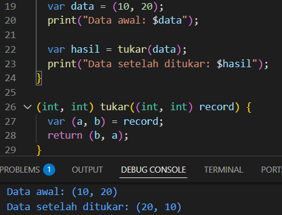

### Langkah 4

Tambahkan kode program berikut di dalam scope void main(), lalu coba eksekusi (Run) kode Anda.

```dart
(String, int) mahasiswa;
print(mahasiswa);
```

Apa yang terjadi ? Jika terjadi error, silakan perbaiki. Inisialisasi field nama dan NIM Anda pada variabel record mahasiswa di atas. Dokumentasikan hasilnya dan buat laporannya!

**Jawaban:**

Kode di atas error karena variabel mahasiswa dideklarasikan tetapi belum diinisialisasi

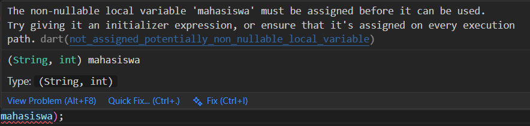

Setelah ditambahkan inisialisasi dengan nama dan NIM:
```dart
void main () {
  var record = ('first', a: 2, b: true, 'last');
  print(record);

  var data = (10, 20);
  print("Data awal: $data");

  var hasil = tukar(data);
  print("Data setelah ditukar: $hasil");

  (String, int) mahasiswa;
  mahasiswa = ('Atiqah Fathin Fauziyyah', 244107060031);
  print(mahasiswa);
}

(int, int) tukar((int, int) record) {
  var (a, b) = record;
  return (b, a);
}
```

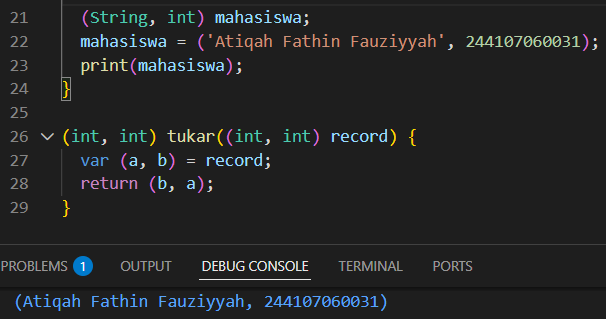

### Langkah 5

Tambahkan kode program berikut di dalam scope void main(), lalu coba eksekusi (Run) kode Anda.
```dart
var mahasiswa2 = ('first', a: 2, b: true, 'last');

print(mahasiswa2.$1); 
print(mahasiswa2.a); 
print(mahasiswa2.b); 
print(mahasiswa2.$2); 
```

Apa yang terjadi ? Jika terjadi error, silakan perbaiki. Gantilah salah satu isi record dengan nama dan NIM Anda, lalu dokumentasikan hasilnya dan buat laporannya!

**Jawaban:**

Kode ini berjalan tanpa error. Kode digunakan untuk mengakses field di dalam Record:
1. .$1, .$2, dst. untuk mengakses positional fields berdasarkan urutan (index mulai dari 1)
2. .namaField untuk mengakses named fields langsung dengan namanya

Setelah ditambahkan inisialisasi dengan nama dan NIM:

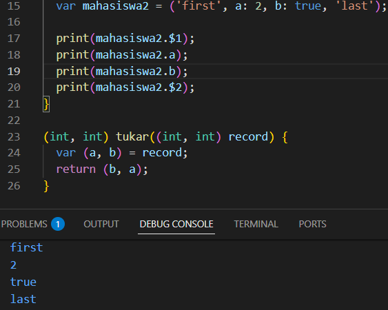

---

## Tugas Praktikum

2. Jelaskan yang dimaksud Functions dalam bahasa Dart!

Function adalah sekumpulan kode yang dibuat untuk melakukan suatu proses tertentu dan bisa dipanggil berulang kali agar program lebih efisien dan tidak perlu menulis kode yang sama berulang-ulang.

3. Jelaskan jenis-jenis parameter di Functions beserta contoh sintaksnya!

a. Required parameter : parameter yang harus dipanggil 
```dart
void sapa(String nama) {
  print("Halo $nama");
}
void main() {
  sapa("Fathin");
}
```

b.  Optional positional parameter : parameter yang tidak wajib di isi dan ditulis dalam tanda kurung siku
```dart
void sapa(String nama, [String? pesan]) {
  print("Halo $nama");
  print(pesan);
}
void main() {
  sapa("Fathin");
}
```

c. Named parameter : parameter yang dipanggil menggunakan nama parameternya, ditulis dalam kurung kurawal
```dart
void dataMahasiswa({String? nama, int? umur}) {
  print("Nama: $nama");
  print("Umur: $umur");
}
void main() {
  dataMahasiswa(nama: "Fathin", umur: 19);
}
```

d. Required named parameter : named parameter yang wajib diisi menggunakan kata kunci required
```dart 
void dataMahasiswa({required String nama, required int umur}) {
  print("Nama: $nama");
  print("Umur: $umur");
}
void main() {
  dataMahasiswa(nama: "Fathin", umur: 19);
}
```

4. Jelaskan maksud Functions sebagai first-class objects beserta contoh sintaknya!

First-class objects yaitu fungsi dapat diperlakukan seperti data atau objek, sehingga dapat disimpan dalam variabel, dikirim sebagai parameter, dan dikembalikan dalam program. Artinya function bisa:

* disimpan ke variabel
* dikirim sebagai parameter
* dikembalikan dari function lain

```dart
int kali(int a, int b) => a * b;

Function ambilFungsi() {
  return kali;
}

void jalankan(Function f) {
  print(f(4, 5));
}

void main() {
  var f = ambilFungsi();
  jalankan(f);
}
```

5. Apa itu Anonymous Functions? Jelaskan dan berikan contohnya!

Anonymous functions merupakan fungsi yang tidak memiliki nama, fungsi ini biasa digunakan untuk operasi singkat dan sering dipakai sebagai parameter dalam fungsi lain
```dart
void main() {
  var kurang = (int a, int b) {
    return a - b;
  };
  print(kurang(10, 3));
}
```

6. Jelaskan perbedaan Lexical scope dan Lexical closures! Berikan contohnya!

a. lexical scope : aturan yang menentukan bahwa sebuah variabel dapat diakses berdasarkan penulisan kode dalam program
```dart
void main() {
  var nama = "Fathin";

  void sapa() {
    print("Halo $nama");
  }
  sapa();
}
```

b. lexical closure : fungsi yang menyimpan variabel dari scope tempat fungsi tersebut dibuat, bahkan ketika fungsi dipanggil di tempat lain
```dart
Function pembuat() {
  int angka = 0;

  return () {
    angka++;
    print(angka);
  };
}

void main() {
  var f = pembuat();
  f();
  f();
}
```

7. Jelaskan dengan contoh cara membuat return multiple value di Functions!

a. contoh dengan return multiple value menggunakan record 
```dart
(String, int) ambilData() {
  return ("Fathin", 19);
}

void main() {
  var hasil = ambilData();
  print(hasil);
}
```

b. contoh dengan destructuting 
```dart
(String, int) ambilData() {
  return ("Fathin", 19);
}

void main() {
  var (nama, umur) = ambilData();
  print("Nama: $nama");
  print("Umur: $umur");
}
```

Function di Dart digunakan untuk membuat kode lebih rapi, bisa fleksibel dengan berbagai jenis parameter, dan bahkan bisa diperlakukan seperti data (first-class object).