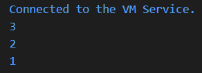
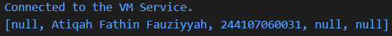

# Laporan Praktikum #04 - Pemrograman Dasar Dart - Bag.3 (Collections dan Functions)

## Identitas Mahasiswa 

| Atribut | Nilai                   |
| ------- | ----------------------- |
| Nama    | Atiqah Fathin Fauziyyah |
| NIM     | 244107060031            |
| Kelas   | SIB-2E                  |

---

## Praktikum 1

### Langkah 1
```dart
var list = [1, 2, 3];
assert(list.length == 3);
assert(list[1] == 2);
print(list.length);
print(list[1]);

list[1] = 1;
assert(list[1] == 1);
print(list[1]);
```

### Langkah 2

Silakan coba eksekusi (Run) kode pada langkah 1 tersebut. Apa yang terjadi? Jelaskan!

**Jawaban:**

1. `var list = [1, 2, 3];`
    * Sebuah list dibuat dengan isi 3 elemen: 1, 2, 3.
    * Index list dimulai dari 0.

2. `assert(list.length == 3);`
    * list.length = 3 karena ada 3 elemen.
    * assert digunakan untuk memastikan kondisi benar saat debugging.
    * Karena benar, program lanjut tanpa error.

3. `assert(list[1] == 2);`
    * list[1] berarti elemen kedua.
    * Nilainya memang 2.
    * Kondisi benar berarti program lanjut.

4. `print(list.length);`
    * Menampilkan panjang list
    * Output 3

5. `print(list[1]);`
    * Menampilkan elemen index 1
    * Output 2

6. `list[1] = 1;`
    * Elemen pada index 1 diubah dari 2 menjadi 1.

7. `assert(list[1] == 1);`
    * Sekarang list[1] memang 1.
    * Kondisi benar berarti program lanjut.

8. `print(list[1]);`
    * Output 1

Output dari program:



### Langkah 3

Ubah kode pada langkah 1 menjadi variabel final yang mempunyai index = 5 dengan default value = null. Isilah nama dan NIM Anda pada elemen index ke-1 dan ke-2. Lalu print dan capture hasilnya.

**Jawaban:**

```dart
void main() {
  final List<String?> data = List.filled(5, null);

  data[1] = "Atiqah Fathin Fauziyyah";
  data[2] = "244107060031";

  print(data);
}
```

1. `final List<String?> data = List.filled(5, null);`
* Membuat list dengan panjang 5.
* Semua elemen awalnya null.
* String? artinya boleh berisi String atau null.

2. `data[1] = "Atiqah Fathin Fauziyyah";`
`data[2] = "244107060031";`
* Mengisi data pada index ke 1 dan 2.

3. `print(data);`
* Menampilkan isi list.

Output dari program:

