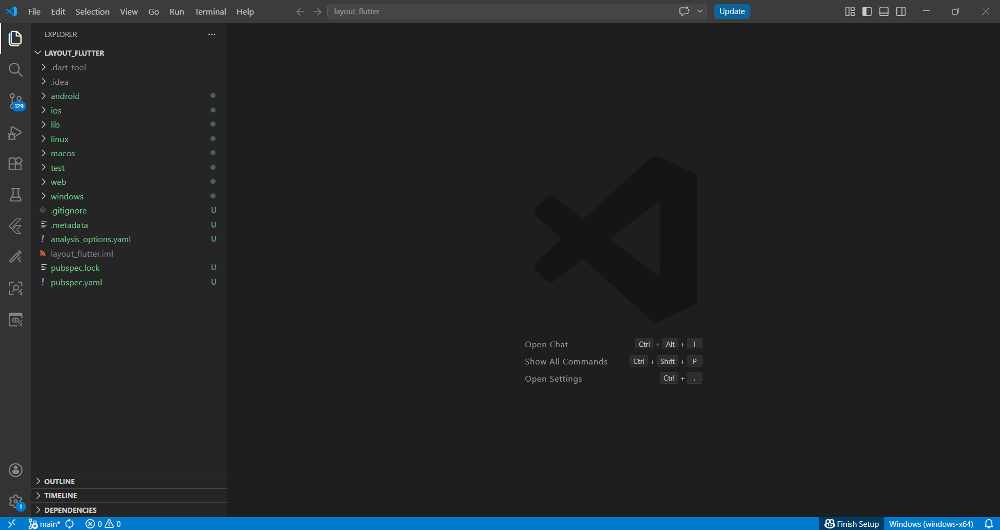
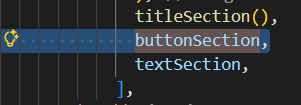
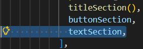
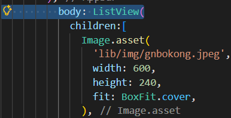
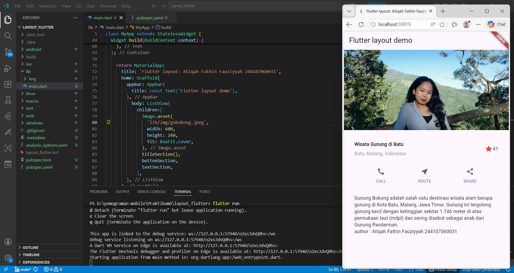
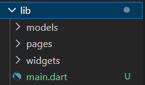
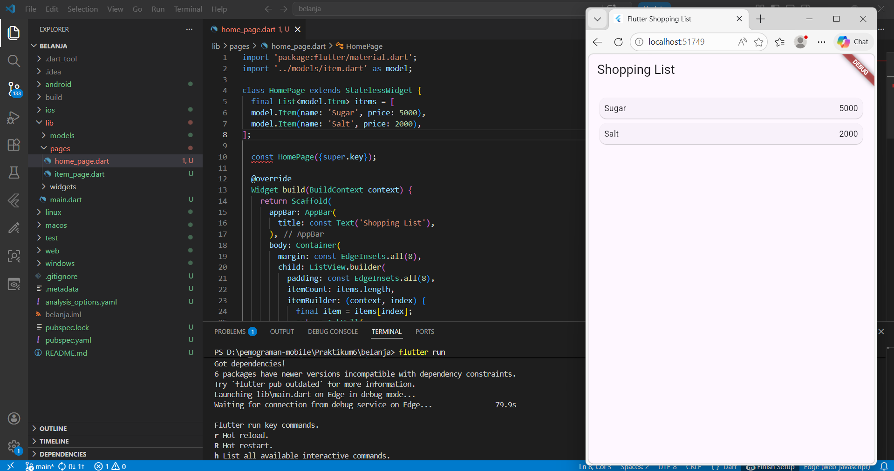
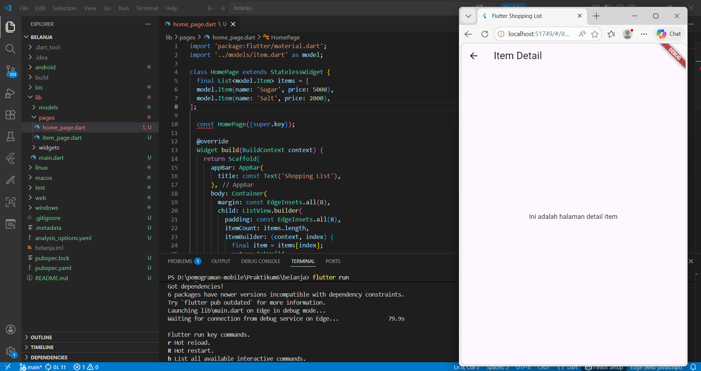

# Laporan Praktikum #06 - Layout dan Navigasi

## Identitas Mahasiswa 

| Atribut | Nilai                   |
| ------- | ----------------------- |
| Nama    | Atiqah Fathin Fauziyyah |
| NIM     | 244107060031            |
| Kelas   | SIB-2E                  |

---

## Praktikum 1 : Membangun Layout di Flutter

### Langkah 1

Buatlah sebuah project flutter baru dengan nama layout_flutter. Atau sesuaikan style laporan praktikum yang Anda buat.



### Langkah 2

Buka file `main.dart` lalu ganti dengan kode berikut. Isi nama dan NIM Anda di `text title`.

```dart
import 'package:flutter/material.dart';

void main() => runApp(const MyApp());

class MyApp extends StatelessWidget {
  const MyApp({super.key});

  @override
  Widget build(BuildContext context) {
    return MaterialApp(
      title: 'Flutter layout: Atiqah Fathin Fauziyyah 244107060031',
      home: Scaffold(
        appBar: AppBar(
          title: const Text('Flutter layout demo'),
        ),
        body: const Center(
          child: Text('Hello World'),
        ),
      ),
    );
  }
}
```

---

### Langkah 4

/* soal 1 */ Letakkan widget `Column` di dalam widget `Expanded` agar menyesuaikan ruang yang tersisa di dalam widget `Row`. Tambahkan properti `crossAxisAlignment` ke `CrossAxisAlignment.start` sehingga posisi kolom berada di awal baris.

/* soal 2 */ Letakkan baris pertama teks di dalam `Container` sehingga memungkinkan Anda untuk menambahkan padding = 8. Teks `‘Batu, Malang, Indonesia'` di dalam `Column`, set warna menjadi abu-abu.

/* soal 3 */ Dua item terakhir di baris judul adalah ikon bintang, set dengan warna merah, dan teks "41". Seluruh baris ada di dalam `Container` dan beri padding di sepanjang setiap tepinya sebesar 32 piksel. Kemudian ganti isi `body text ‘Hello World'` dengan variabel `titleSection` seperti berikut:

```dart
Widget titleSection () { 
  return Container(
  padding: const EdgeInsets.all(32),
  child: Row(
    children: [
      Expanded(
        /* soal 1*/
        child: Column(
          crossAxisAlignment: CrossAxisAlignment.start,
          children: [
            /* soal 2*/
            Container(
              padding: const EdgeInsets.only(bottom: 8),
              child: const Text(
                'Wisata Gunung di Batu',
                style: TextStyle(
                  fontWeight: FontWeight.bold,
                ),
              ),
            ),
            Text(
              'Batu, Malang, Indonesia',
              style: TextStyle(
                color: Colors.grey,
              ),
            ),
          ],
        ),
      ),
      /* soal 3*/
      Icon(
       Icons.star,
        color: Colors.red,
      ),
      const Text('41'),
    ],
  ),
);
}
```

---

## Praktikum 2 : Implementasi button row

### Langkah 1

Bagian tombol berisi 3 kolom yang menggunakan tata letak yang sama—sebuah ikon di atas baris teks. Kolom pada baris ini diberi jarak yang sama, dan teks serta ikon diberi warna primer.

Karena kode untuk membangun setiap kolom hampir sama, buatlah metode pembantu pribadi bernama `buildButtonColumn()`, yang mempunyai parameter warna, `Icon` dan `Text`, sehingga dapat mengembalikan kolom dengan widgetnya sesuai dengan warna tertentu.

**lib/main.dart (_buildButtonColumn)**

```dart
Column _buildButtonColumn(Color color, IconData icon, String label) {
    return Column(
      mainAxisSize: MainAxisSize.min,
      mainAxisAlignment: MainAxisAlignment.center,
      children: [
        Icon(icon, color: color),
        Container(
          margin: const EdgeInsets.only(top: 8),
          child: Text(
            label,
            style: TextStyle(
              fontSize: 12,
              fontWeight: FontWeight.w400,
              color: color,
            ),
          ),
        ),
      ],
    );
  }
```

### Langkah 2

Bangun baris yang berisi kolom-kolom ini dengan memanggil fungsi dan set warna, `Icon`, dan teks khusus melalui parameter ke kolom tersebut. Sejajarkan kolom di sepanjang sumbu utama menggunakan `MainAxisAlignment`.spaceEvenly untuk mengatur ruang kosong secara merata sebelum, di antara, dan setelah setiap kolom. Tambahkan kode berikut tepat di bawah deklarasi `titleSection` di dalam metode `build()`:

**lib/main.dart (buttonSection)**

```dart
Color color = Theme.of(context).primaryColor;

Widget buttonSection = Row(
  mainAxisAlignment: MainAxisAlignment.spaceEvenly,
  children: [
    _buildButtonColumn(color, Icons.call, 'CALL'),
    _buildButtonColumn(color, Icons.near_me, 'ROUTE'),
    _buildButtonColumn(color, Icons.share, 'SHARE'),
  ],
);
```

### Langkah 3

Tambahkan variabel `buttonSection` ke dalam `body` seperti berikut:



---

## Praktikum 3: Implementasi text section

### Langkah 1

Tentukan bagian teks sebagai variabel. Masukkan teks ke dalam `Container` dan tambahkan padding di sepanjang setiap tepinya. Tambahkan kode berikut tepat di bawah deklarasi `buttonSection`:

```dart
Widget textSection = Container(
    padding: const EdgeInsets.all(32),
    child: const Text(
      'Gunung Bokong adalah salah satu destinasi wisata alam berupa gunung di Kota Batu, Malang, Jawa Timur. Gunung ini tergolong gunung kecil dengan ketinggian sekitar 1.746 meter di atas permukaan laut (mdpl) dan sering disebut sebagai anak dari Gunung Panderman.\n'
      'author : Atiqah Fathin Fauziyyah 244107060031',
      softWrap: true,
    ),
  );
```

Dengan memberi nilai `softWrap` = true, baris teks akan memenuhi lebar kolom sebelum membungkusnya pada batas kata.

### Langkah 2

Tambahkan widget variabel `textSection` ke dalam `body` seperti berikut:



---

## Praktikum 4: Implementasi image section

### Langkah 1

Mencari gambar dan Masukkan file gambar tersebut ke folder `lib/img`, lalu set nama file tersebut ke file `pubspec.yaml` seperti berikut:

```dart
flutter:
  uses-material-design: true
  assets:
    - lib/img/gnbokong.jpeg
```

### Langkah 2

Tambahkan aset gambar ke dalam `body` dan `BoxFit.cover` memberi tahu kerangka kerja bahwa gambar harus sekecil mungkin tetapi menutupi seluruh kotak rendernya. seperti berikut:

```dart
Image.asset(
  'lib/img/gnbokong.jpeg',
  width: 600,
  height: 240,
  fit: BoxFit.cover,
),
```

### Langkah 3

Atur semua elemen dalam `ListView`, bukan Column, karena `ListView` mendukung scroll yang dinamis saat aplikasi dijalankan pada perangkat yang resolusinya lebih kecil.



**Hasil dari 4 Praktikum beserta beberapa langkahnya:**



---


## Praktikum 5: Membangun Navigasi di Flutter

### Langkah 1

Membuat sebuah project baru Flutter dengan nama belanja dan susunan folder seperti pada gambar berikut. Penyusunan ini dimaksudkan untuk mengorganisasi kode dan widget yang lebih mudah.



### Hasil Langkah 2-7

**1) lib/models/item.dart**

```dart
class Item {
  String name;
  int price;

  Item({required this.name, required this.price});
}
```

**2) lib/pages/home_page.dart**

```dart
import 'package:flutter/material.dart';
import '../models/item.dart' as model;

class HomePage extends StatelessWidget {
  final List<model.Item> items = [
  model.Item(name: 'Sugar', price: 5000),
  model.Item(name: 'Salt', price: 2000),
];

  const HomePage({super.key});

  @override
  Widget build(BuildContext context) {
    return Scaffold(
      appBar: AppBar(
        title: const Text('Shopping List'),
      ),
      body: Container(
        margin: const EdgeInsets.all(8),
        child: ListView.builder(
          padding: const EdgeInsets.all(8),
          itemCount: items.length,
          itemBuilder: (context, index) {
            final item = items[index];
            return InkWell(
              onTap: () {
                // Berpindah ke rute '/item'
                Navigator.pushNamed(context, '/item');
              },
              child: Card(
                child: Container(
                  margin: const EdgeInsets.all(8),
                  child: Row(
                    children: [
                      Expanded(child: Text(item.name)),
                      Expanded(
                        child: Text(
                          item.price.toString(),
                          textAlign: TextAlign.end,
                        ),
                      ),
                    ],
                  ),
                ),
              ),
            );
          },
        ),
      ),
    );
  }
}
```

**3) lib/pages/item_page.dart**

```dart
import 'package:flutter/material.dart';

class ItemPage extends StatelessWidget {
  const ItemPage({super.key});

  @override
  Widget build(BuildContext context) {
    return Scaffold(
      appBar: AppBar(
        title: const Text('Item Detail'),
      ),
      body: const Center(
        child: Text('Ini adalah halaman detail item'),
      ),
    );
  }
}
```

**4) lib/main.dart**

```dart
import 'package:flutter/material.dart';
// Import file halaman dan model yang sudah kamu buat sebelumnya
import 'pages/home_page.dart';
import 'pages/item_page.dart';

void main() {
  runApp(const MyApp());
}

class MyApp extends StatelessWidget {
  const MyApp({super.key});

  @override
  Widget build(BuildContext context) {
    return MaterialApp(
      title: 'Flutter Shopping List',
      theme: ThemeData(
        colorScheme: ColorScheme.fromSeed(seedColor: Colors.deepPurple),
        useMaterial3: true,
      ),
      // MENGGUNAKAN ROUTES SESUAI LANGKAH 3
      // initialRoute menentukan halaman yang pertama kali muncul
      initialRoute: '/',
      routes: {
        '/': (context) => HomePage(),
        '/item': (context) => ItemPage(),
      },
    );
  }
}
```

**Hasil Praktikum:**





---