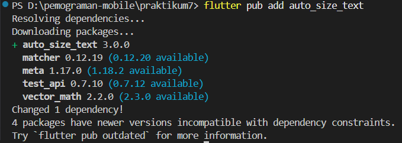
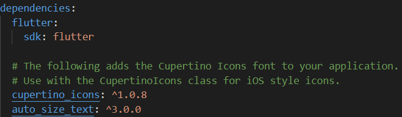
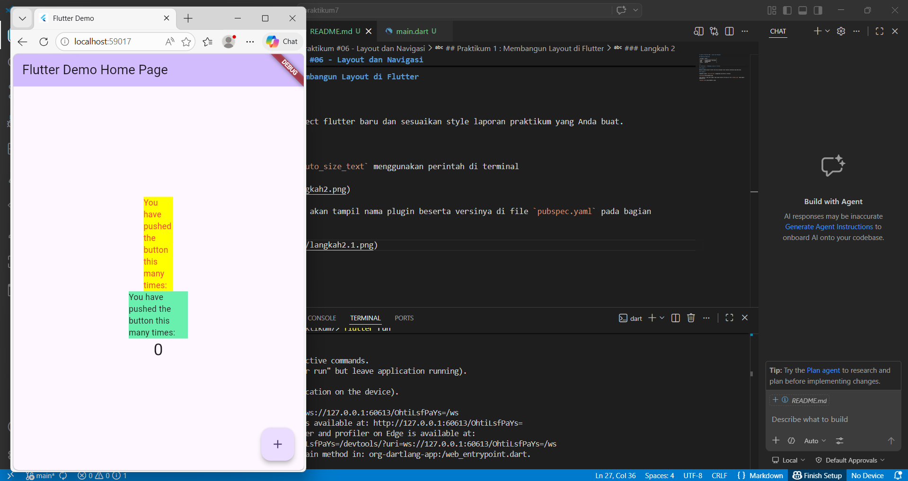

# Laporan Praktikum #06 - Layout dan Navigasi

## Identitas Mahasiswa 

| Atribut | Nilai                   |
| ------- | ----------------------- |
| Nama    | Atiqah Fathin Fauziyyah |
| NIM     | 244107060031            |
| Kelas   | SIB-2E                  |

---

## Praktikum 1 : Membangun Layout di Flutter

### Langkah 1

Buatlah sebuah project flutter baru dan sesuaikan style laporan praktikum yang Anda buat.

### Langkah 2

Tambahkan plugin `auto_size_text` menggunakan perintah di terminal



Jika berhasil, maka akan tampil nama plugin beserta versinya di file `pubspec.yaml` pada bagian dependencies.



### Langkah 3

Buat file baru bernama red_text_widget.dart di dalam folder lib lalu isi kode seperti berikut.
```dart
import 'package:flutter/material.dart';

class RedTextWidget extends StatelessWidget {
  const RedTextWidget({Key? key}) : super(key: key);

  @override
  Widget build(BuildContext context) {
    return Container();
  }
}
```

### Langkah 4

Masih di file red_text_widget.dart, untuk menggunakan plugin auto_size_text, ubahlah kode return Container() menjadi seperti berikut.
```dart
return AutoSizeText(
      text,
      style: const TextStyle(color: Colors.red, fontSize: 14),
      maxLines: 2,
      overflow: TextOverflow.ellipsis,
);
```

Setelah Anda menambahkan kode di atas, Anda akan mendapatkan info error. Mengapa demikian? Jelaskan dalam laporan praktikum Anda!

Jawaban :
Karena AutoSizeText belum di-import dan Variabel text tidak didefinisikan

### Langkah 5

Tambahkan variabel text dan parameter di constructor seperti berikut.
```dart
final String text;
const RedTextWidget({Key? key, required this.text}) : super(key: key);
```

### Langkah 6

Buka file main.dart lalu tambahkan di dalam children: pada class _MyHomePageState
```dart
Container(
   color: Colors.yellowAccent,
   width: 50,
   child: const RedTextWidget(
             text: 'You have pushed the button this many times:',
          ),
),
Container(
    color: Colors.greenAccent,
    width: 100,
    child: const Text(
           'You have pushed the button this many times:',
          ),
),
```

Run aplikasi tersebut dengan tekan F5, maka hasilnya akan seperti berikut.



## Tugas Praktikum

2. Jelaskan maksud dari langkah 2 pada praktikum tersebut!

**Jawaban :**
Langkah 2 bertujuan untuk menambahkan plugin/package `auto_size_text` ke dalam project Flutter agar aplikasi dapat menggunakan widget `AutoSizeText`. Plugin ini berfungsi untuk membuat ukuran teks menyesuaikan otomatis dengan ruang yang tersedia sehingga teks tidak terpotong atau overflow.

3. Jelaskan maksud dari langkah 5 pada praktikum tersebut!

**Jawaban :**
Tujuannya adalah untuk membuat custom widget bernama `RedTextWidget`.

4. Pada langkah 6 terdapat dua widget yang ditambahkan, jelaskan fungsi dan perbedaannya!

**Jawaban :**
| Aspek                               | RedTextWidget                    | Text                  |
| ----------------------------------- | -------------------------------- | --------------------- |
| Jenis widget                        | Custom widget                    | Widget bawaan Flutter |
| Kemampuan resize teks               | Ya, otomatis menyesuaikan ukuran | Tidak                 |
| Responsif terhadap ukuran container | Lebih baik                       | Bisa overflow         |
| Penggunaan plugin                   | Menggunakan `auto_size_text`     | Tidak                 |
| Fleksibilitas                       | Lebih fleksibel                  | Lebih sederhana       |

5. Jelaskan maksud dari tiap parameter yang ada di dalam plugin auto_size_text berdasarkan tautan pada dokumentasi ini!

**Jawaban :**
| Parameter             | Fungsi                                                    |
| --------------------- | --------------------------------------------------------- |
| `text` / `data`       | Isi teks yang ditampilkan                                 |
| `style`               | Mengatur gaya teks seperti ukuran, warna, bold, dll       |
| `maxLines`            | Menentukan jumlah maksimum baris teks                     |
| `minFontSize`         | Ukuran font minimum saat teks diperkecil                  |
| `maxFontSize`         | Ukuran font maksimum yang diperbolehkan                   |
| `stepGranularity`     | Besar pengurangan ukuran font tiap langkah resize         |
| `overflow`            | Mengatur tampilan jika teks tetap tidak muat              |
| `overflowReplacement` | Widget pengganti jika teks overflow                       |
| `textAlign`           | Mengatur posisi teks (left, center, right)                |
| `presetFontSizes`     | Menentukan daftar ukuran font tertentu yang boleh dipakai |
| `group`               | Menyamakan ukuran font beberapa `AutoSizeText`            |
| `wrapWords`           | Mengatur apakah kata boleh dipotong saat pindah baris     |
| `minFontSize`         | Batas ukuran terkecil font                                |
| `locale`              | Mengatur bahasa/locale teks                               |
| `semanticsLabel`      | Label aksesibilitas untuk screen reader                   |

Contoh penggunaan:

```dart
AutoSizeText(
  'Hello Flutter',
  style: TextStyle(fontSize: 30),
  maxLines: 2,
  minFontSize: 12,
)
```